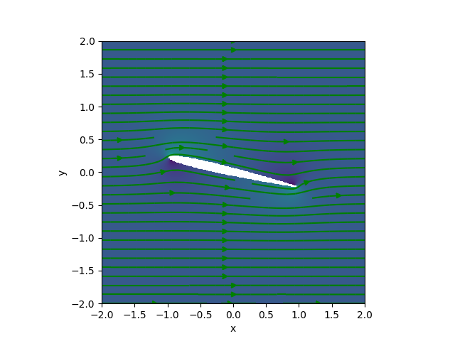

# Windtunnel simulation
A toy model that solves the [Navier Stokes equations](https://en.wikipedia.org/wiki/Navier%E2%80%93Stokes_equations) for the flow of a wing around a wind.
## Compiling
These instructions have been tested on with:
- cmake/3.25.2
- nvhpc/22.2
The nvhpc suite provides the fortran openmpi cuda aware implementation.

You will need a `Fortran` compiler and `CMake` installed. You will also need an MPI library. If building with CUDA support (for an NVIDIA GPU), the MPI library needs to be CUDA aware. In most cases , it should be enough to run: 
```bash
mkdir build
cd build
FC=mpif90 cmake ../
```
If building with GPU support, then you should define the USE_CUDA variable: 
```bash
FC=mpif90 cmake ../ -DUSE_CUDA=ON
```


## Running 
An example input file is present in the file `config.txt`. 
The main variables are given in the `&SHAPEPARAMS` section where:

*  `ALPHA` is the angle of attack of the wing against the wind direction,
*  `M` is the maximum camber of the wing and  
* `T` is the thickness of the wing section (as a faction of the wing length).

Additional variables in this section are `nx_global` and `ny_global` which are the number of cells in the x and y direction respectively.

The calculation can be launched on a GPU by setting `device = .TRUE.` and `device= .FALSE.` if you do not want to compile for a GPU.

If you run the code from the `build` directory, you will need to:

```bash
cp src/windtunnel .  # Copy the executable to the local directory
cp ../config.txt .   # Copy the configuration file to the local directory.
export OMP_NUM_THREADS=${OMP_THREADS}
mpirun -np ${NUM_RANKS} ./windtunnel
```

You can then run the program by assigning the environment variable `OMP_NUM_THREADS` with an integer less or equal to the number of cores available on your machine and `NUM_RANKS` can be set as the number of MPI processes to run the code on.

```bash
export OMP_NUM_THREADS=1 # Number of OpenMP threads to use
export NUM_RANKS=4       # Number of MPI processes to run on
mpirun -np ${NUM_RANKS} windtunnel
```

The program will write the output binary files:

- `output.dat`
- `potential.dat`: the potential flow 

The output files contain a binary dump of arrays containing grid and field information.
Also several information is printed out in the standard output, including drag and lift.



## Wind shape
The shape of the wing is a cambered 4-digit NACA airfoil [https://en.wikipedia.org/wiki/NACA_airfoil ](https://en.wikipedia.org/wiki/NACA_airfoil) . An implementation is found in the `areofoil` routine at `vars.f90:159`.

